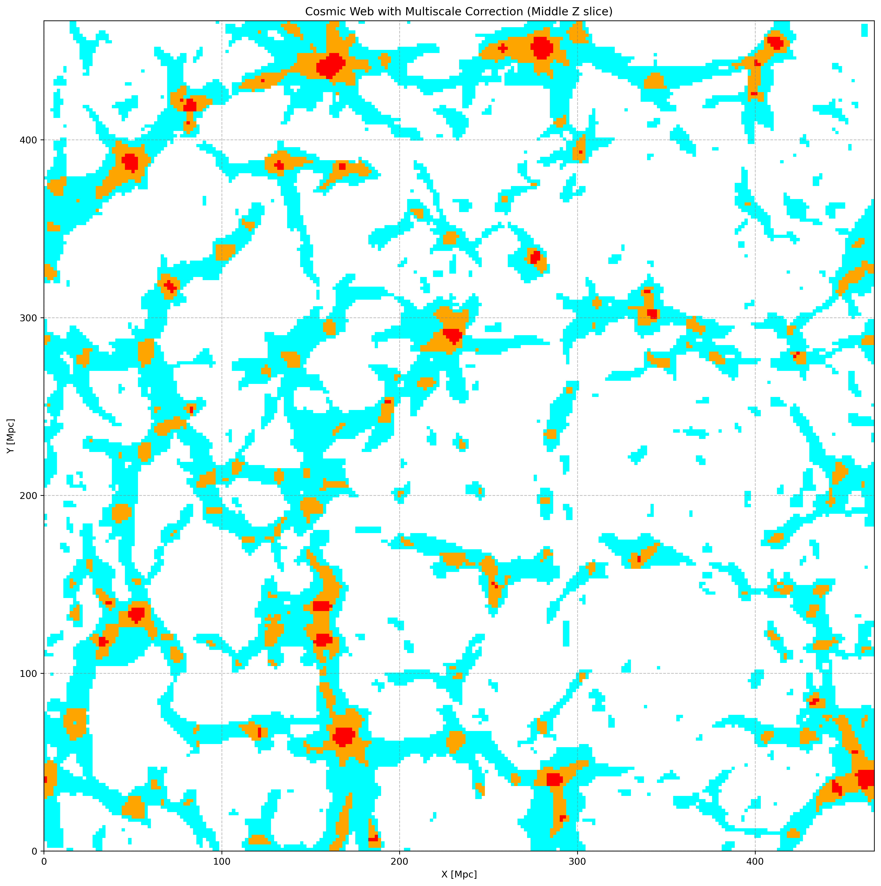

## CosmicWebClassification 

### Description
Simple python code for classifying cosmic web structure in cosmological simulations following [Hoffman et al 2012](https://academic.oup.com/mnras/article/425/3/2049/982860).

### Developers
Jordan Winstanley & Chris Power

### Installation
You can install as a package by doing the following;

```
git clone https://github.com/jwinstan/CosmicWebClassification.git
cd CosmicWebClassification
pip install -e .
```
This will load any dependencies needed by the scripts. 

You can call it from within python using 
```
from CosmicWebClassification.cosmic_web import CosmicWebClassifier
```

Class can be constructed via

```
web_classifier = CosmicWebClassifier(box_size, grid_size, method)
```
Currently available methods:
  - Nearest grid point "ngp"
  - Cloud in cell "cic"
  - Triangular shaped cloud "tsc"


Data can be added using
```
web_classifier.add_batch(positions, velocities, masses)
```

Execution via
```
web = web_classifier.classify_structure()
```

A simple plot can be made with
```
web_classifier.plot("test.png")
```


